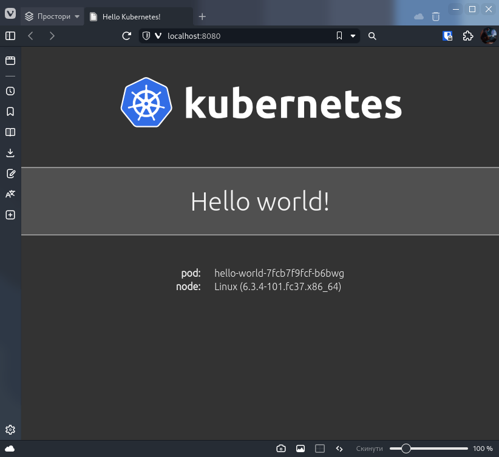

# Concept

- [Concept](#concept)
  - [Вступ](#вступ)
  - [Характеристики](#характеристики)
    - [Minikube](#minikube)
    - [Kind](#kind)
    - [K3d](#k3d)
  - [Переваги та недоліки](#переваги-та-недоліки)
  - [Podman](#podman)
  - [Приклади використання](#приклади-використання)
  - [Демонстрація](#демонстрація)
  - [Висновки](#висновки)

## Вступ

У цьому порівняльному аналізі ми розглянемо три інструменти для розгортання Kubernetes кластерів в локальному середовищі: `minikube`, `kind` та `k3d`. Ми також обговоримо ризики, пов'язані з ліцензуванням Docker та можливість використання альтернативи — Podman. Опис кожного інструменту, його характеристики, переваги та недоліки будуть надані для полегшення вибору.

## Характеристики

### Minikube

Minikube є локальною системою Kubernetes, яка дозволяє розгортати кластер Kubernetes на одному комп'ютері. Minikube є зручним варіантом для розробки та тестування на локальному комп'ютері. Однак, виникли сумніви щодо обмеження можливостей масштабування.

- Основні характеристики
  - Підтримувані ОС: Linux, macOS та Windows.
  - Підтримувані архітектури: x86 та ARM.
  - Можливість автоматизації: так.
  - Наявність додаткових функцій: моніторинг та керування Kubernetes - кластером.

### Kind

Kind (Kubernetes IN Docker) є інструментом, який дозволяє створювати локальні Kubernetes кластери в Docker контейнерах. AsciiArtify припускають можливість використання kind для локального тестування.

- Основні характеристики
  - Підтримувані ОС: Linux, macOS та Windows.
  - Підтримувані архітектури: x86 та ARM.
  - Можливість автоматизації: так.
  - Наявність додаткових функцій: моніторинг та керування Kubernetes кластером.

### K3d

K3d є інструментом для створення локальних Kubernetes кластерів в Docker контейнерах з використанням Rancher Kubernetes Engine (RKE). K3d дозволяє швидко створювати та тестувати кластери Kubernetes у Docker-контейнерах. AsciiArtify також вирішили використовувати k3d для підготовки PoC.

- Основні характеристики
  - Підтримувані ОС: Linux, macOS та Windows.
  - Підтримувані архітектури: x86 та ARM.
  - Можливість автоматизації: так.
  - Наявність додаткових функцій: моніторинг та керування Kubernetes кластером.

## Переваги та недоліки

<!-- markdownlint-disable MD033 -->
| Інструмент | Переваги                                                                                              | Недоліки                           |
| ---------- | ----------------------------------------------------------------------------------------------------- | ---------------------------------- |
| Minikube   | Легкість використання.<br /> Швидкість розгортання.                                                   | Обмежені можливості масштабування. |
| Kind       | Легкість використання.<br /> Можливість використання Docker контейнерів.                              | Обмежені можливості масштабування. |
| K3d        | Легкість використання.<br /> Швидкість розгортання.<br /> Можливість використання Docker контейнерів. | Не знайдено.                       |
<!-- markdownlint-enable MD033 -->

## Podman

Podman є інструментом для управління контейнерами, який працює на рівні користувача і невимагає демона, що робить його більш безпечним за використанням порівняно з Docker. У Podman є підтримка Kubernetes, яка дозволяє запускати Kubernetes кластери в контейнерах без необхідності встановлювати Docker. Однак, підтримка Kubernetes у Podman все ще є експериментальною та може бути нестабільною на деяких платформах.

- Основні характеристики
  - Підтримувані ОС: Linux.
  - Підтримувані архітектури: x86 та ARM.
  - Можливість автоматизації: так.
  - Наявність додаткових функцій: підтримка Kubernetes.

- Переваги
  - Не вимагає демона.
  - Безпечніше за використанням порівняно з Docker.
  - Управління контейнерами на рівні користувача.
  - Інтеграція зі стандартними інструментами Linux. Такими як:
    - systemd
    - runc
    - CNI
  - Зручне керування контейнерами.
  - Підтримка Kubernetes.
  - Безпека контейнерів:
    - підтримка SELinux
    - `rootless` режим з підтримкою `user namespaces`, що дозволяє запускати контейнери без прав root.

- Недоліки
  - Підтримка Kubernetes є експериментальною та може бути нестабільною на деяких платформах.
  - Підтримується тільки на Linux
    - найкраща підтримка на Fedora

<!-- markdownlint-disable MD029 -->
## Приклади використання

Приклад використання `k3d` для розгортання локального Kubernetes кластеру.
Запустимо простий веб-сервер у контейнері з "Hello World" сторінкою.

1. Впевністься, що `k3d` та `kubectl` встановлені на вашій системі.
2. Створимо кластер `k3d` з ім'ям `mycluster` та одним вузлом.

   ```bash
   k3d cluster create mycluster --agents 1
   ```

3. Перевіримо, що кластер створений.

   ```bash
   k3d cluster list # або k cluster-info
   ```

4. Створимо `hello-world.yaml` файл з наступним вмістом:

   ```yaml
   apiVersion: apps/v1
   kind: Deployment
   metadata:
     name: hello-world
   spec:
     replicas: 1
     selector:
       matchLabels:
         app: hello-world
     template:
       metadata:
         labels:
           app: hello-world
       spec:
         containers:
           - name: hello-world
             image: "paulbouwer/hello-kubernetes:1.8"
             ports:
               - containerPort: 8080
   ```

5. Запустимо `hello-world` деплоймент.

   ```bash
    k apply -f hello-world.yaml
    ```

6. Перевіримо, що деплоймент запущений.

    ```bash
    k get deployments # або k get deploy
    ```

7. Ви маєте побачити наступний результат:

    ```bash
    NAME          READY   UP-TO-DATE   AVAILABLE   AGE
    hello-world   1/1     1            1           2m
    ```

8. Перевіримо, що `hello-world` контейнер запущений.

    ```bash
    k get pods # або k get po
    ```

9. Ви маєте побачити наступний результат:

    ```bash
    NAME                           READY   STATUS    RESTARTS   AGE
    hello-world-7c9d6b7b4f-2q9qg   1/1     Running   0          2m
    ```

10. Перевіримо, що `hello-world` контейнер доступний.

    ```bash
    k get services # або k get svc
    ```

11. Ви маєте побачити наступний результат:

    ```bash
    NAME         TYPE        CLUSTER-IP     EXTERNAL-IP   PORT(S)    AGE
    kubernetes   ClusterIP   10.43.0.1    <none>        443/TCP   3m51s
    ```

12. Запустимо `hello-world` контейнер.

    ```bash
    k port-forward deployment/hello-world 8080:8080
    ```

13. Відкрийте `http://localhost:8080` у вашому браузері.
14. Ви маєте побачити наступний результат:

    

15. Зупинимо `hello-world` контейнер.

    ```bash
    k delete -f hello-world.yaml
    ```

16. Зупинимо `k3d` кластер.

    ```bash
    k3d cluster delete mycluster
    ```
<!-- markdownlint-enable MD029 -->

## Демонстрація

[](https://asciinema.org/a/589243)

## Висновки

З порівняльного аналізу було виявлено, що всі три інструменти - minikube, kind та k3d - можуть бути використані для розгортання локального Kubernetes кластеру. Кожен інструмент має свої переваги та недоліки, які необхідно враховувати при виборі. Minikube та Kind мають обмежені можливості масштабування, тоді як K3d не має знайдених недоліків. Проте, це не означає, що K3d є найкращим вибором для кожного випадку. У залежності від потреб, можуть бути важливими інші характеристики, такі як підтримка ОС, можливості автоматизації та наявність додаткових функцій.

Також було розглянуто інший інструмент - Podman, який є альтернативою Docker для управління контейнерами та підтримує Kubernetes. Podman має кілька переваг, включаючи безпеку, що робить його більш безпечним за використанням порівняно з Docker, підтримку SELinux та можливість запуску контейнерів без прав root. Проте, підтримка Kubernetes у Podman все ще може бути нестабільною на деяких платформах.

Загалом, вибір інструменту для розгортання локального Kubernetes кластеру залежить від потреб в конкретному випадку. Якщо швидкість розгортання та легкість використання є головними факторами, то K3d може бути кращим вибором. Якщо безпека є пріоритетом, то Podman може бути кращим вибором. Також можна використовувати різні інструменти для різних потреб або поєднувати їх у складніші рішення.
