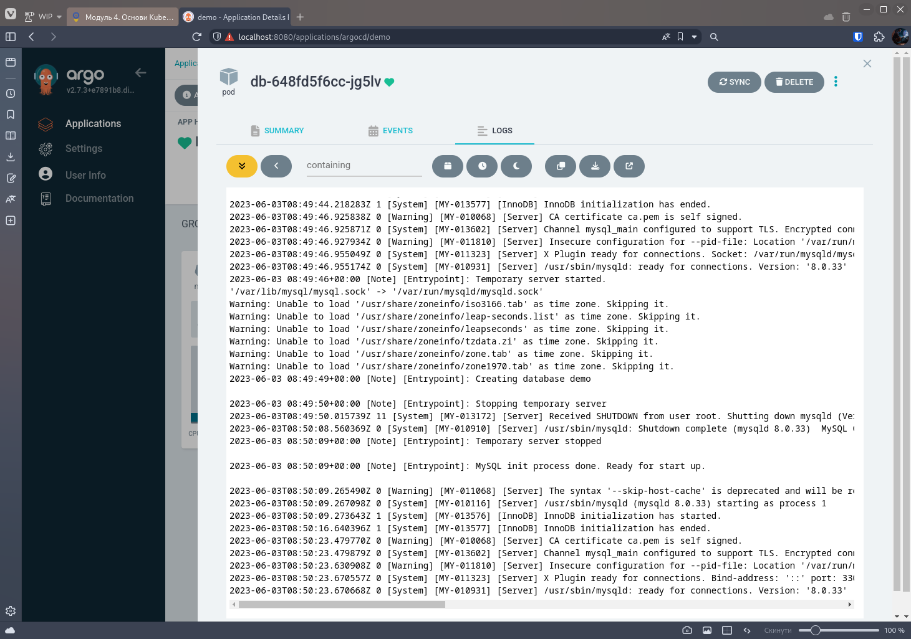
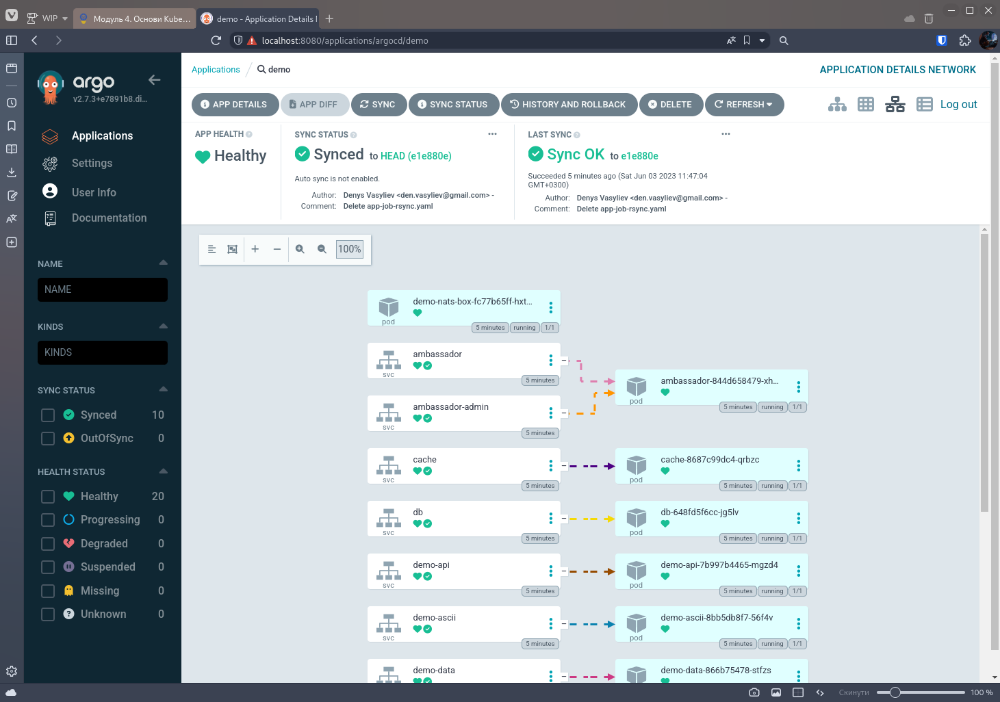

# Minimum Viable Product

## Робота з ArgoCD

Створюємо новий додаток у ArgoCD:


Перевіряємо статус додатку:


Перевіряємо логи та статус синхронізації:



## Перевіряємо роботу застосунку

```bash
# Перенаправляємо порт нашого застосунку
k port-forward -n demo svc/ambassador 8088:80
```

```bash
# Перевіряємо роботу застосунку
❯ curl localhost:8088
k8sdiy-api:599e1af%

# Перевіряємо роботу застосунку з зображеннями
❯ curl -F 'image=@./doc/assets/rocket.png' localhost:8088/img/
```


