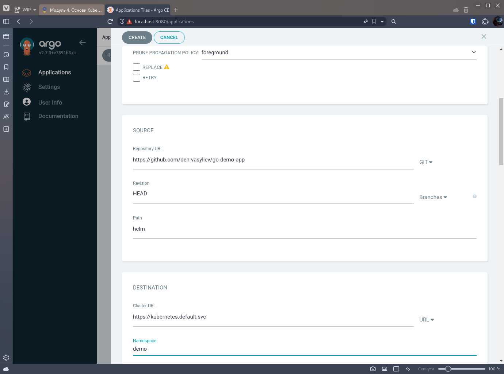
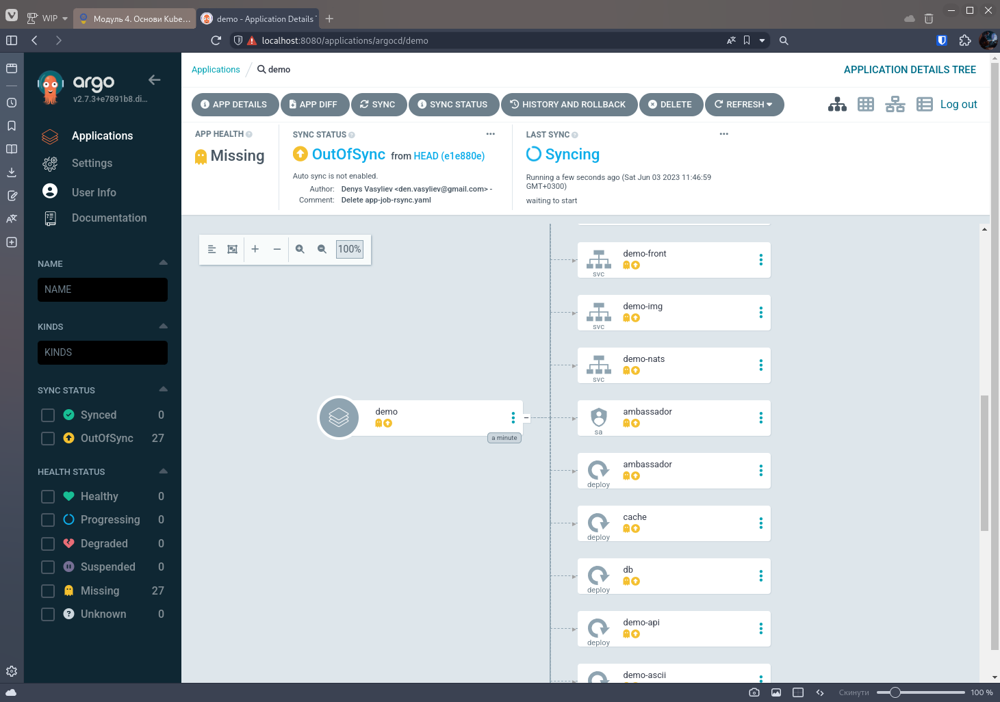
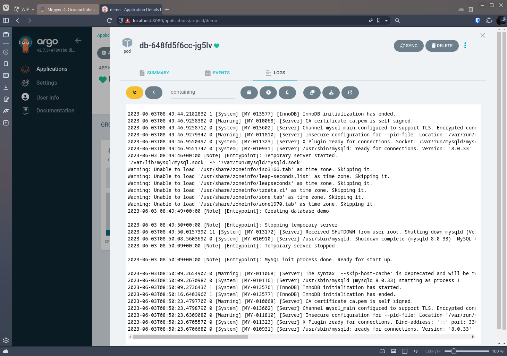
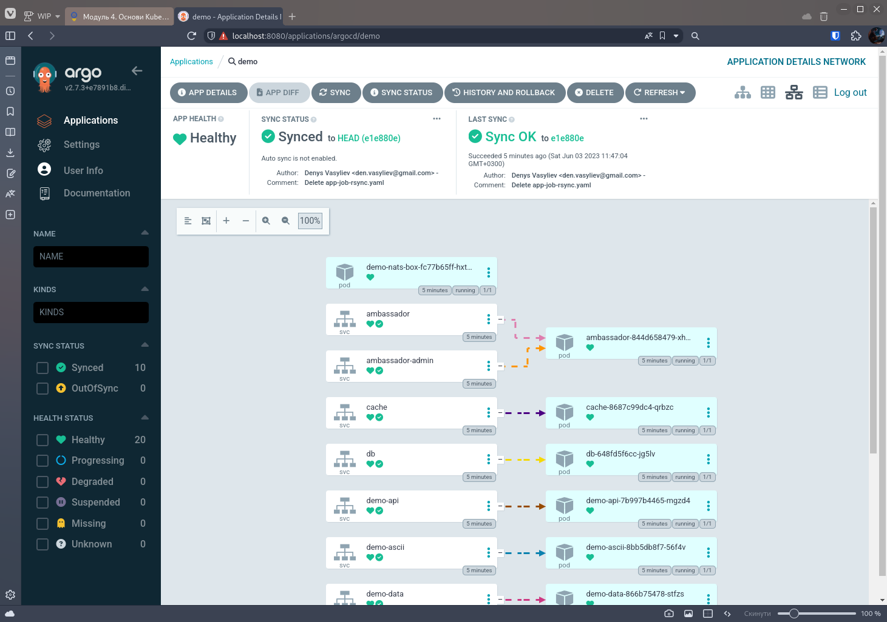
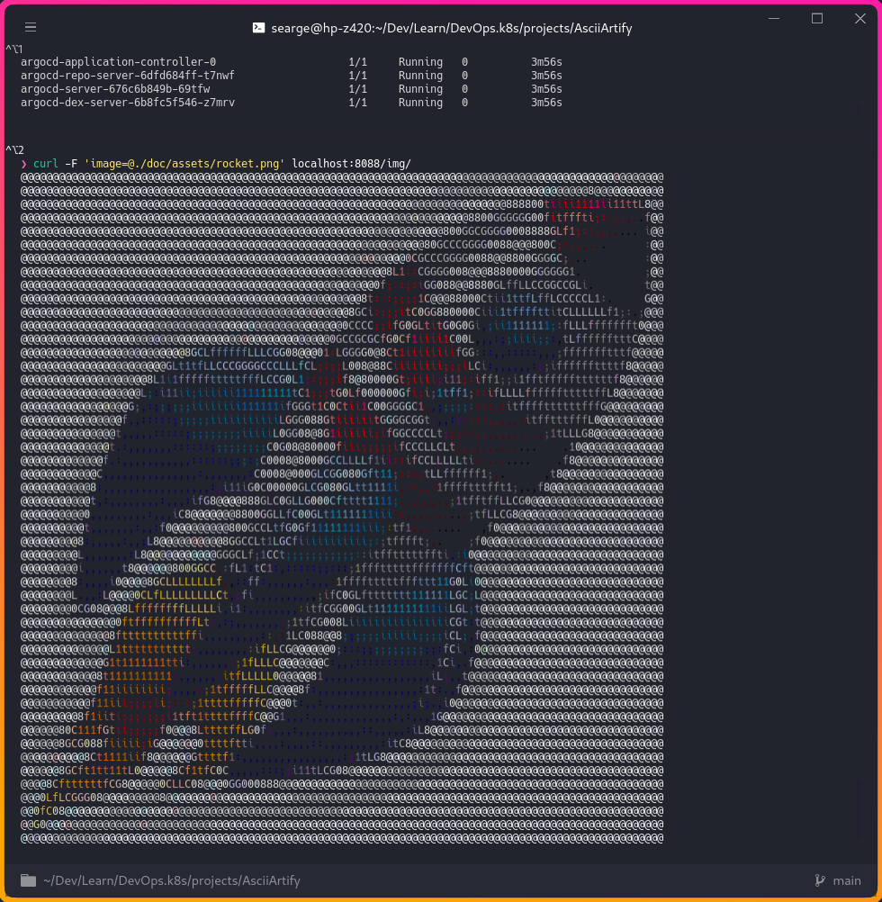

# Proof of Concept

Встановлення та налаштування командного доступу до GUI ArgoCD у кластері Kubernetes.

## Вимоги до середовища

- `k3d` - [k3d](https://k3d.io/) - інструмент для створення локальних кластерів Kubernetes у Docker
- `kubectl` - [kubectl](https://kubernetes.io/docs/tasks/tools/) - інструмент для керування кластерами Kubernetes
- `argocd` - [ArgoCD Cli](https://argo-cd.readthedocs.io/en/stable/cli_installation/) - інструмент для керування декларативними конфігураціями Kubernetes

## Встановлення ArgoCD

1. Використаємо спосіб встановлення ArgoCD на основі [документації](https://argo-cd.readthedocs.io/en/stable/getting_started/#1-install-argo-cd):

   ```bash
   k3d cluster create argo;
   kubectl create namespace argocd &&
     kubectl apply -n argocd \
     -f https://raw.githubusercontent.com/argoproj/argo-cd/stable/manifests/install.yaml
   ```

2. Зачекаємо на завершення розгортання ArgoCD:

   ```bash
   k wait --for=condition=available --timeout=00s \
     deployment/argocd-server -n argocd
   ```

3. Перевіримо, що ArgoCD запущений:

   ```bash
   k get po -n argocd
   ```

   ```text
   NAME                                                READY   STATUS    RESTARTS   AGE
   argocd-redis-74d77964b-28fd7                        1/1     Running   0          3m57s
   argocd-notifications-controller-56b4b9db6f-bmrx8    1/1     Running   0          3m57s
   argocd-applicationset-controller-59dcb74c66-6kd2q   1/1     Running   0          3m56s
   argocd-application-controller-0                     1/1     Running   0          3m56s
   argocd-repo-server-6dfd684ff-t7nwf                  1/1     Running   0          3m56s
   argocd-server-676c6b849b-69tfw                      1/1     Running   0          3m56s
   argocd-dex-server-6b8fc5f546-z7mrv                  1/1     Running   0          3m56s
   ```

4. Підготуємо командний доступ до ArgoCD:

   ```bash
   kubectl port-forward svc/argocd-server -n argocd 8080:443&
   ```

5. Перейдемо за посиланням [https://localhost:8080](https://localhost:8080) та авторизуємось за допомогою логіну `admin` та паролю з `argocd`:

   ```bash
   argocd admin initial-password -n argocd
   ```

## Робота з ArgoCD

Створюємо новий додаток у ArgoCD:


Перевіряємо статус додатку:


Перевіряємо логи та статус синхронізації:



## Перевіряємо роботу застосунку

```bash
# Перенаправляємо порт нашого застосунку
k port-forward -n demo svc/ambassador 8088:80
```

```bash
# Перевіряємо роботу застосунку
❯ curl localhost:8088
k8sdiy-api:599e1af%

# Перевіряємо роботу застосунку з зображеннями
❯ curl -F 'image=@./doc/assets/rocket.png' localhost:8088/img/
```


